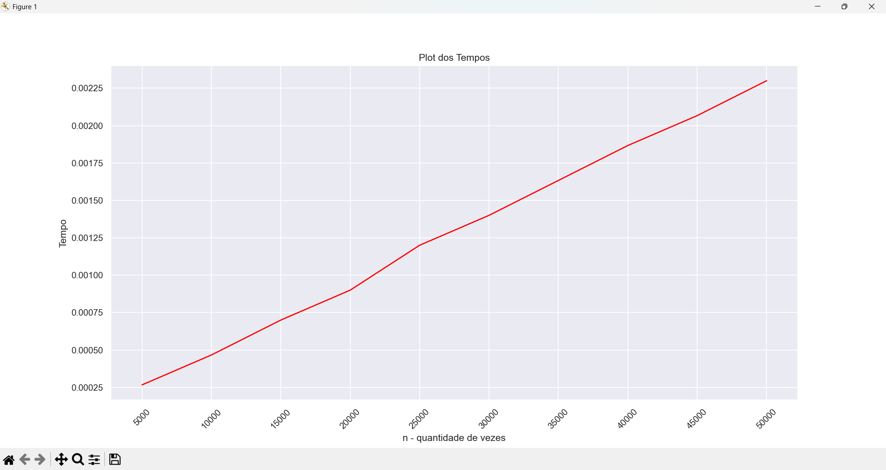
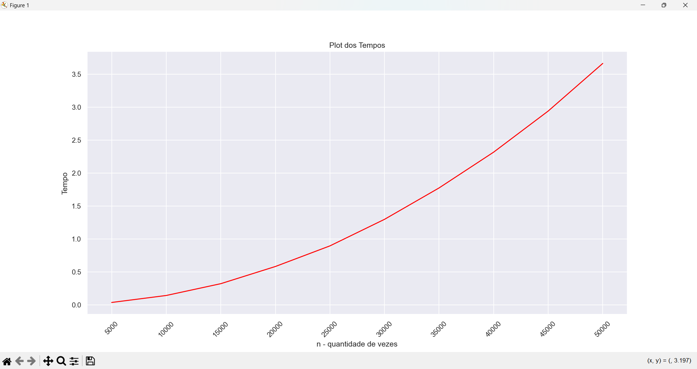

# Experimento_Complexidade_de_Algoritmos


<p>Este experimento de complexidade de algoritmos foi feito como projeto de Estrutura de Dados na [UENP](https://uenp.edu.br/).<p>  


## Sobre


<p>Neste projeto criamos um arquivo txt com o tempo demorado para a ordenação de 5.000 listas, e o valor vai aumentando em 5.000 até chegar em 50.000 listas. Para termos uma boa média, criamos 30 vezes a mesma quantidade de listas. Depois fazemos uma média e criamos uma gráfico em python.<p>  


## Como usar  


Para clonar o repositório:  

```bash
   https://github.com/RafaelTomazGraciano/Experimento_Complexidade_de_Algoritmos.git
```

<p>Para rodar os códigos é necessário ter instalado python e minGW. Depois basta instalar as duas biblliotecas abaixo<p>  

Para instalar o matplotlib abra o terminal e digite:

```bash
   pip install matplotlib
```

Para instalar o seaborn abra o terminal e digite:

```bash
   pip install seaborn
```


<p>Primeiramente, deve-se rodar o código em C, e depois o código em pyhton, que gerará o gráfico de Complexidade de Algoritmo.<p>  


### Gráfico de uma Função Linear, Complexidade n

   
  


### Gráfico de uma Função Quadrática, Complexidade n²


  


